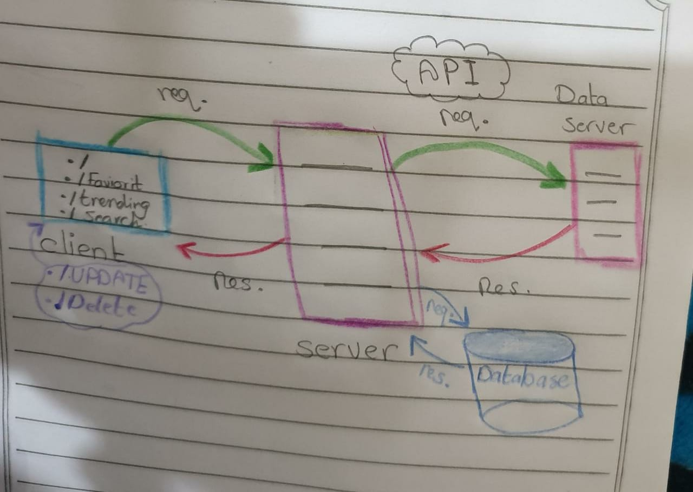

# Movies-Library
# Project Name - Project Version
Movies-Library-V4

**Author Name**: Amani Musallam

## WRRC
Add an image of your WRRC here

## Overview
movie server just adding the main structure 
## Getting Started
this servier should run on computer with not less than these spasification 
windows 10 + , cpu , RAM 

## Project Features
this Appliaction will show the user the uptodate movie with sumary information along with the location of live events 
five more pages added Trending search , TV shows and season 
the DB connected  to add movie and another route added to check the added one 
newly added routed - 
three more routes added to give the user the ability to 
1- update on any of movie 
2- Remove from the move 
3- select only one 
Note :   ID should by added to the route ex. /update/5